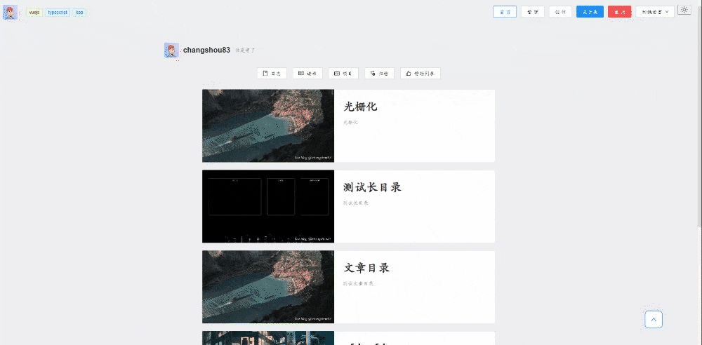
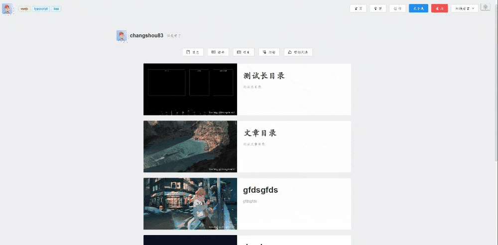

# 简介

koa-blog 是一个免费开源的个人博客系统。使用了最新的`Vue3`，`Vite2`，`Ant-Design-Vue`，`TypeScript`，`Unocss`等主流技术开发，使用`Vitest`进行单元测试的博客系统，也可用于学习参考。
后端则使用`Koa`进行开发，[前往后端项目](https://github.com/changshou83/koa-blog-backend)。

# 当前完成的功能

- 用户的注册，登录和退出

- 博客的编写(富文本编辑器)，发布，更新和删除
  - 管理：
  - 发布：

- 个人页面的展示

- 暗黑模式

- 文章封面自动添加用户水印

- 文章自动缓存

- 骨架屏优化用户体验

- 文章目录的自动生成

- 复制文章内容时自动添加作者的版权信息

- 国际化，目前支持中文和英文

# 后序想要完成的功能

- [ ] 用户个人信息展示与修改(需要更改数据库)(doing)
- [ ] 快捷键(函数做完了，用的keymaster这个包，但是不知道有啥快捷键要用，，)(doing)
- [ ] 处理右上角逻辑问题：在创作的时候可以更新的时候可以点击(doing)
- [ ] 忘记密码与重置密码(doing)
- [ ] 邮箱注册(doing)
- [ ] 用户注销
- [ ] 搜索文章
- [ ] 右键菜单([dropdown - ant-design-vue](https://antdv.com/components/dropdown-cn/#Dropdown-))
- [ ] github-action实现自动部署
- [ ] 评论系统(只需邮箱和用户名)
- [ ] 独立出一个后台管理系统
- [ ] 第三方登录(如果可能的话, [参考](https://gitee.com/zhijiantianya/ruoyi-vue-pro))
- [ ] 富文本迁移([bytemd](https://bytemd.js.org/))
- [ ] 产品步骤引导使用([shepherdjs](https://shepherdjs.dev/)+参考的与vue集成：[vue-shepherd](https://github.com/shipshapecode/vue-shepherd))
- [ ] 用threejs为关于我页面进行体验优化
- [ ] 移动端适配
- [ ] pwa
